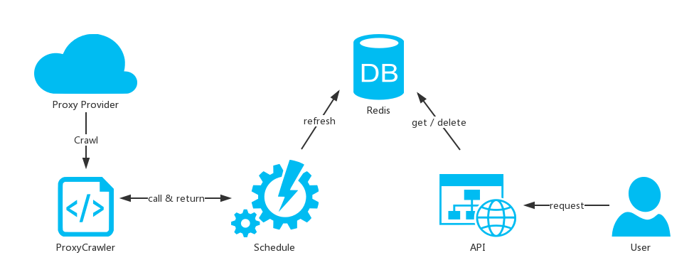

# 简易代理池

这是一个用 Flask + Redis 搭建的简易代理池程序。

一图胜千言：

API是采用Flask框架编写，对用户提供 get / delete 代理的功能。

Schedual是个定时任务，周期性地从网站上爬取代理，验证后刷新Redis（会删掉旧代理）。

抓取的代理分为 http / https / socks5 三种类型，验证代理用gevent协程。

### 启动

api.py 和 schedule.py 需要分别启动

### API

    "get a proxy": "/get/{proxy_type}"
    "delete a proxy": "/delete/{proxy_type}/{ip:port}"

### 参考

[jhao104: proxy_pool][https://github.com/jhao104/proxy_pool]

[廖雪峰: gevent][http://t.cn/RPKBLuo]